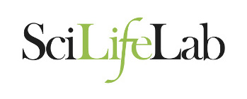

          

# Joint SIB / SciLifeLab Autumn School Single Cell Analysis

### [Schedule](schedule.md)

### Date
13.10.2019 - 18.10.2019

### Location
Hotel Central Residence & Spa, Leysin, Switzerland.

Arrival: Sunday before 18h

Departure: Friday around 14h30

### Course computing environment

## Programme

#### Sunday

* ≈17-18h: arrival of the participants, check-in
* Welcome and dinner

#### Monday: Transcriptomics

* Introductory lecture: Vincent Gardeux, Laboratory of Systems and Genetics, EPFL / SIB, Lausanne, Switzerland.
* Quantification, QC & Normalization: Davide Risso, Department of Statistical Sciences, University of Padova, Italy.
* Dimensionality reduction: Paulo Czarnewski, NBIS, Uppsala University, SciLifeLab, Uppsala, Sweden.

#### Tuesday: Transcriptomics

* Batch correction: Panagiotis Papasaikas, Computational Biology Group, Friedrich Miescher Institute for Biomedical Research / SIB, Basel. Switzerland.
* Clustering - methods overview: Charlotte Soneson, Computational Biology Group, Friedrich Miescher Institute for Biomedical Research / SIB, Basel, Switzerland.
* Cell fate mapping and trajectories: Wouter Saelens, VIB-UGent Center for Inflammation Research, Gent, Belgium.

#### Wednesday: Transcriptomics

* Differential expression: Charlotte Soneson, Computational Biology, Friedrich Miescher Institute for Biomedical Research / SIB, Basel, Switzerland.
* Afternoon: Team activity
* Evening: Keynote lecture: Alejandro Sifrim, Laboratory of Reproductive Genomics, KU Leuwen, Belgium.

#### Thursday: Proteomics

* Transcriptome + proteome: Johan Reimegård, Uppsala University, SciLifeLab, Uppsala, Sweden.
* Differential abundance and differential state analysis of single cell cytometry data: Mark Robinson & Helena Crowell, Statistical Genomics, University of Zurich / SIB, Zurich, Switzerland.

#### Friday: Other omics and integration

* Spatial mapping of scRNAseq: Lars Borm, Department of Medical Biochemistry and Biophysics, Karolinska Institutet, Stockholm, Sweden.
* Lineage tracing and scRNA: Maria Florescu, Hubrecht Institute, Developmental Biology and Stem Cell Research, Utrecht, Netherlands.
* Data integration methods: Sebastien Smallwood, Friedrich Miescher Institute for Biomedical Research, Basel, Switzerland.

### Learning objectives
After this course you will be able to:
- use a range of bioinformatics tools to analyze single cell RNA-seq data
- discuss a variety of aspects of single cell RNA-seq data analysis
- understand the advantages and limitations of single cell RNA-seq data analysis

### Lecturers

### Additional information

Coordination: Björn Nystedt (NBIS/SciLifeLab), Grégoire Rossier (SIB).

Scientific Committe: Åsa Björklund (NBIS/SciLifeLab), Michael Stadler & Charlotte Soneson (SIB and FMI Basel), Vincent Gardeux (EPFL).

For more information, please contact Grégoire Rossier.

