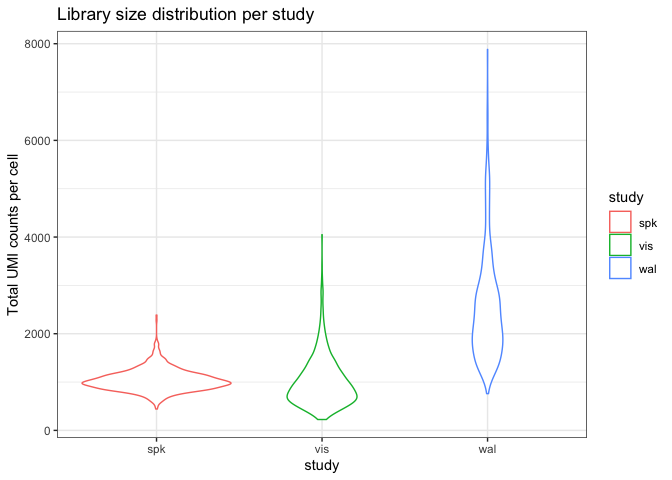
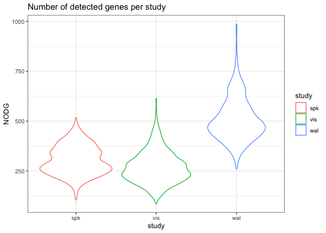
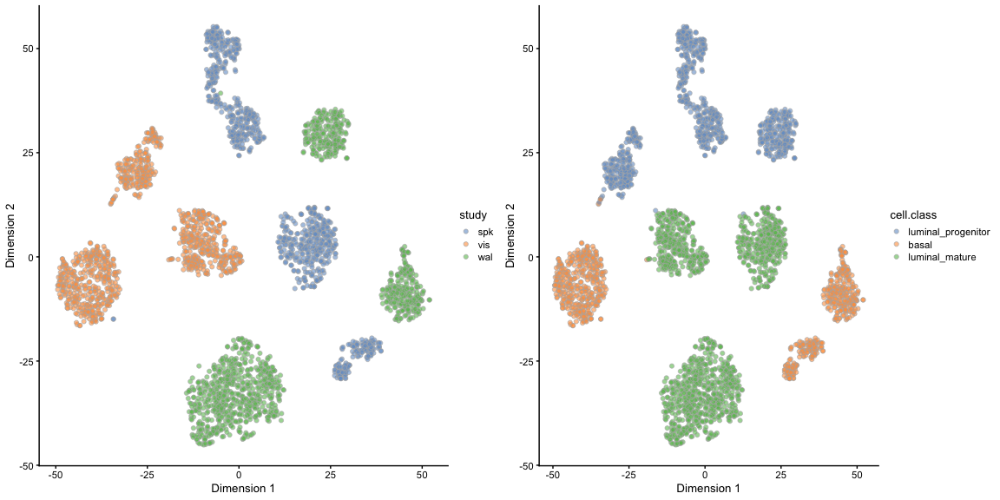
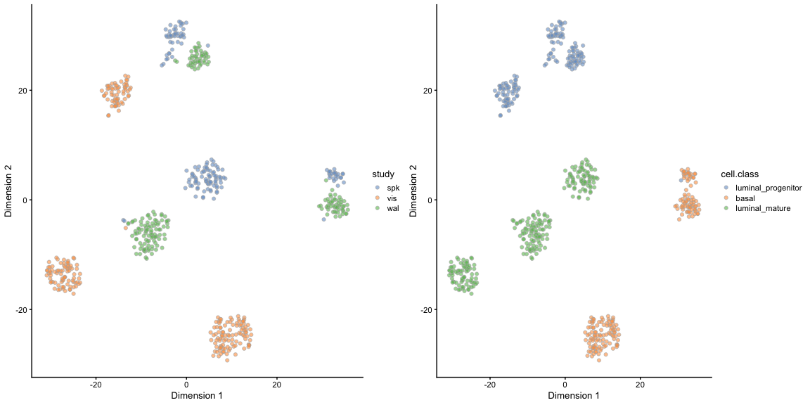
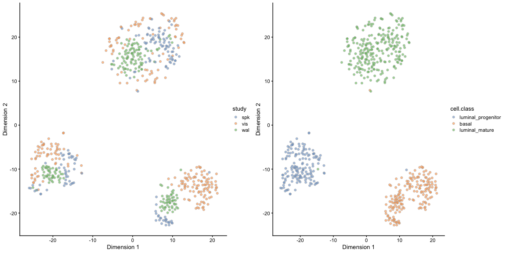
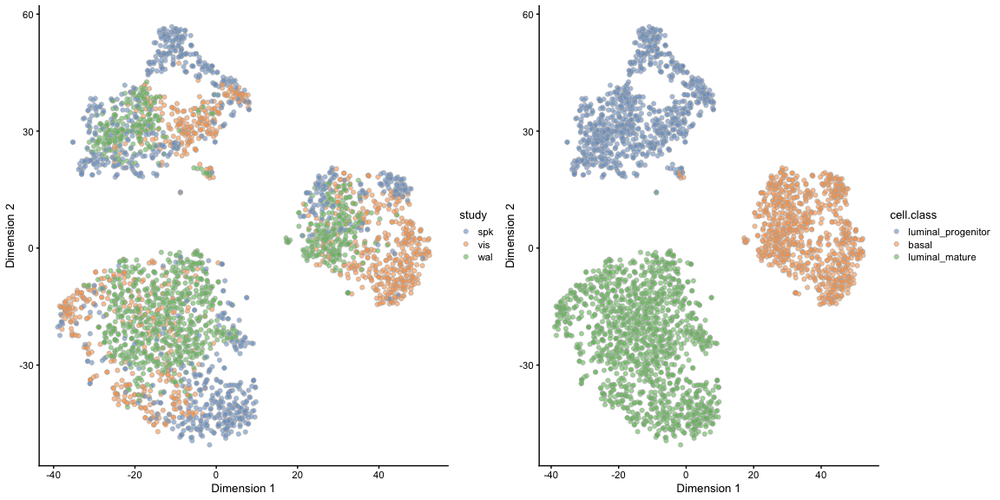
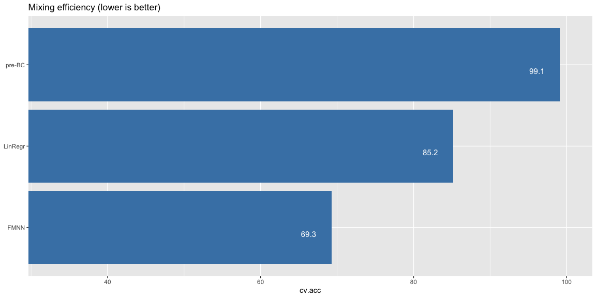
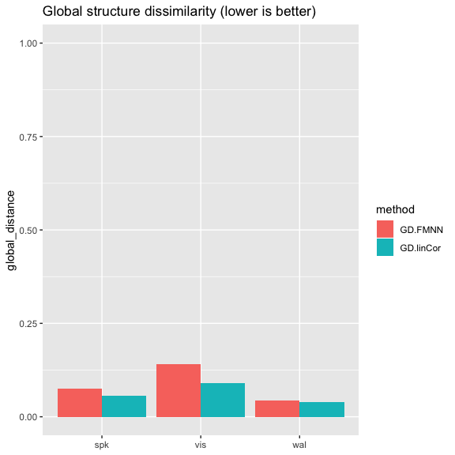
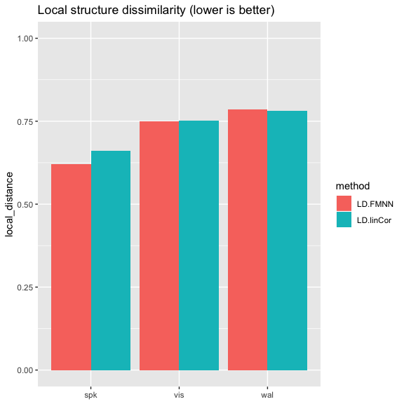

# Introduction

In this lab we will focus on  data integration / batch correction apporaches
specifically appropriate for single cell RNAseq datasets. 
We will go through the steps of 
1. batch effect diagnosis, 
2. actual correction
3. evaluation of the effects/quality of correction.

The dataset that we will use is a composite dataset of three independent
10x runs originating from different labs. It consists of 9288 mammary 
epithelial cells, sequenced using 10x Genomics technology, which has already
been pre-filtered to include only cells that are assigned unambiguously
to one of three major  cell types:
luminal progenitors, luminal mature and basal.

Several of the methods outlined here are based on the scran and batchelor packages
developed by Aaron Lun and colleagues and thus the corresponding R vignette and manual
are excellent sources of additional information ["Single-cell correction with batchelor"](https://bioconductor.org/packages/release/bioc/vignettes/batchelor/inst/doc/correction.html).
The student can also refer to the Integrating datasets chapter of ["Orchestrating single-cell analysis with Bioconductor"](https://osca.bioconductor.org/integrating-datasets.html).
which is also largely based on the batchelor package.


# Load packages

We first load the required R packages. 


```r
suppressPackageStartupMessages({
  library(SummarizedExperiment)
  library(SingleCellExperiment)
  library(scater)
  library(ggplot2)
  library(scran)
  library(batchelor)
  library(BiocSingular)
  library(BiocNeighbors)
  library(e1071)
  library(coop)
  library(Rtsne)
  library(rsvd)
  library(tidyr)
  library(dplyr)
  source("https://raw.githubusercontent.com/NBISweden/single-cell_sib_scilifelab/master/session-batch_correction/Helper_Functions.R")
})
```


# Load the pre-processed dataset:

Next, we load the preprocessed dataset and have a first look at the 
composition of the dataset:


```r
## Download the data and set row names to gene symbols whenever possible
bct <- readRDS(gzcon(url("https://github.com/NBISweden/single-cell_sib_scilifelab/blob/master/datasets/SCE_MammaryEpithelial_x3.rds?raw=true")))
rownames(bct) <- scater::uniquifyFeatureNames(
  ID = rownames(bct), 
  names = as.character(rowData(bct)$gene.symbols)
)

#Subsample cells to speed up knitting / processing
set.seed(42)
n=3000
bct <- bct[, sample(1:ncol(bct), n )  ]

## Dataset compostion per cell type and study:  
table(colData(bct)$study , colData(bct)$cell.class)
```

```
##      
##       luminal_progenitor basal luminal_mature
##   spk                392   145            352
##   vis                228   408            350
##   wal                235   241            649
```


# Batch effect diagnosis

We will now look at some high level characteristics of the three datasets
that clearly indicate the presence of batch effects:


```r
## Check library size amd  number of detected gene distribution in the three datasets:
   ggplot(data.frame(colData(bct)), 
                 aes(x = study, y = library_size, color=study)) + 
              geom_violin() + theme_bw() + 
              ylab("Total UMI counts per cell") + 
              ggtitle("Library size distribution per study") 
```

<!-- -->

```r
   ggplot(data.frame(colData(bct)), 
              aes(x = study, y = detected_genes, color=study)) + 
              geom_violin() + theme_bw() + 
              ylab("NODG") + 
              ggtitle("Number of detected genes per study") 
```

<!-- -->

We can already see the the 3 studies differ in these high level characterstics.
Let's now take a look at the impact of the batch in the TSNE projections generated
without taking any steps for batch correction (apart from a simple library normalization ):


```r
# We first normalize all cells for library size.
assays(bct )[["lognorm"]] <- lin_norm_log(as.matrix(  logcounts(bct) ), factor=1e+04)  
reducedDim(bct, "PCA" )  <- rsvd::rpca(t( assay(bct,"lognorm") ),k=32,retx=TRUE,center=TRUE,scale=FALSE)$x


reducedDim(bct, "TSNE" ) <- Rtsne( reducedDim(bct,"PCA"), perplexity = 30, initial_dims=32, pca=FALSE, theta=0.3)$Y #~15-60 seconds run time

cowplot::plot_grid(scater::plotTSNE(bct, colour_by = "study" ),
                   scater::plotTSNE(bct, colour_by = "cell.class"))
```

<!-- -->


# Library normalization and PCA methods customized for the presence of batches

We saw above that our data form distinct clusters according to both study origin as well as biological cell type.
We now take a first step towards batch correction using approaches for 

* A. library normalization and 
* B. PCA 
that explicitly account for the presence of batches.

The new library normalization strategy is essentially a 3-step process:

1. Similar cells (cell with similar expression profiles) are pooled together using the scran function quickCluster (or any othe sensible clustering method).
2. Size factors are computed using the deconvolution method (Lun et al., 2016) and using the scran function computeSumFactors
3. Systematic differences in coverage across batches are removed by rescaling the size factors using median-based
normalization on the ratio of the average counts between batches.This is done using the multiBatchNorm() function  from the batchelor package. 
The function multiBatchNorm from the scran package provides identical functionality.


The new PCA strategy is performed using the multibatchPCA() function from the batchelor package. This is essentially
performing PCA on the merged matrix of the three batches but now each batch is "forced" to contribute equally to the
identification of the loading vectors. In addition each batch's contribution to the gene-gene covariance matrix is 
normalized by the corresponding number of cells.


```r
bct.mBN <- bct #Create a copy of the single cell experiment

# Clustering:
clusters <- scran::quickCluster(bct.mBN , method = "igraph", min.mean = 0.1,
                                  use.ranks = FALSE, BSPARAM = IrlbaParam(),
                                  irlba.args = list(maxit = 1000),
                                  #BPPARAM = MulticoreParam(workers = 16)
                                 )
print(table(clusters))
```

```
## clusters
##   1   2   3   4   5   6   7   8 
## 361 383 255 345 650 417 356 233
```

```r
# Size factor calculation using the deconvolution method:
bct.mBN <- scran::computeSumFactors(bct.mBN , min.mean = 0.1, cluster = clusters,
                                #BPPARAM = MulticoreParam(workers = 16)
                                ) 


# Library normalization that corrects for batch-specific differences in size factors:
mBN <- batchelor::multiBatchNorm(V = bct.mBN[,bct.mBN$study=="vis"],
                                 W = bct.mBN[,bct.mBN$study=="wal"],
                                 S = bct.mBN[,bct.mBN$study=="spk"])
bct.mBN <- cbind( mBN$V, mBN$W, mBN$S) 
# Notice that only the logcount slot is affected. 
# The counts (and the custom lognorm assays) of the original bct object 
# are unaffected.

# Mutli-batch PCA that makes sure each batch contributes equally to the loading vectors:
mB.PCA <- batchelor::multiBatchPCA( bct.mBN, batch=bct.mBN$study, d=32, preserve.single = TRUE)
reducedDim(bct.mBN , "PCA" )  <- mB.PCA[[1]]

# Let's now recalculate the projection and see if the improved normalization
# affected the quality of the projections:
reducedDim(bct.mBN , "TSNE" ) <- Rtsne(reducedDim(bct.mBN,"PCA"), perplexity = 30, initial_dims=32, pca=FALSE, theta=0.3)$Y #~15-60 seconds run time

cowplot::plot_grid(scater::plotTSNE(bct.mBN, colour_by = "study" ),
                   scater::plotTSNE(bct.mBN, colour_by = "cell.class")
                   )
```

<!-- -->


# Batch effect correction using linear regression

The most common approaches for correcting batch effects in the case of bulk RNA-seq datasets are based on linear regression.
Typically a linear model is fitted per-gene where the batch effect is accounted for by a separate term in our model specification.
Once we fit the model, the batch-specific effects can be corrected for by setting this term to zero.
This is the basis of the removeBatchEffect() function from the limma package (Ritchie et al. 2015) as well the comBat() function
from the sva package (Leek et al).
The rescaleBatches() function from the batchelor package takes a similar approach, with adjustments for improving efficiency in the
single-cell regime. Specifically, for each gene, the mean expression in each batch is scaled down until it is equal to the 
lowest mean across all batches. 


```r
bct.linCor <- bct.mBN 
bct.linCor  <- batchelor::rescaleBatches(bct.linCor, batch=bct.linCor$study)
colData(bct.linCor) <-  colData(bct.mBN )  


reducedDim(bct.linCor, "PCA" )  <- rsvd::rpca( t( assay(bct.linCor,"corrected") ) ,k=32,retx=TRUE,center=TRUE,scale=FALSE)$x
reducedDim(bct.linCor, "TSNE" ) <- Rtsne(reducedDim(bct.linCor, "PCA"), perplexity = 30, initial_dims=32, pca=FALSE, theta=0.3)$Y #~15-60 seconds run time

cowplot::plot_grid(scater::plotTSNE(bct.linCor, colour_by = "study" ),
                   scater::plotTSNE(bct.linCor, colour_by = "cell.class")
                   )
```

<!-- -->

An interesting exercise is to repeat the linear correction, but this time using as input the bct object where
library normalization has not taken into account the presence of batches. Do you see any differences?


# Batch effect correction using fast-MNN

Now we will use the matching mutual nearest neighbors technique first proposed by (Haghverdi et al. 2018).
The function that implements this is fastMNN() from the batchelor package.
The input to this function should be the object containing the result of the multiBatchNorm method that
we used above. 
If multiBatchPCA has not already been performed then this is done internally. In this case since we have 
pre-calculated  it we will skip recalculation.


```r
d <- 32
FMNN.out <-  batchelor::fastMNN( bct.mBN  , batch=bct.mBN$study , use.dimred="PCA", d=d ) 
```

```
## Warning in (function (jobs, data, centers, info, distance, k, query,
## get.index, : tied distances detected in nearest-neighbor calculation
```

```r
# Notice that the type of object the function returns depends on the input as well as on 
# whether the use.dimred argument is set. In this case we get back a dataframe with a matrix
# corrected low-dimensional coordinates and a batch slot specifying batch origin.
reducedDim (bct.mBN, "PCA.FMNN" ) <- FMNN.out$corrected 

reducedDim(bct.mBN, "TSNE.FMNN" ) <- Rtsne( reducedDim(bct.mBN, "PCA.FMNN"), perplexity = 30, initial_dims=64, pca=FALSE,num_threads=32,theta=0.25)$Y

cowplot::plot_grid(scater::plotReducedDim(bct.mBN, colour_by = "study", use_dimred="TSNE.FMNN" ),
                   scater::plotReducedDim(bct.mBN, colour_by = "cell.class", use_dimred="TSNE.FMNN")
                   )
```

<!-- -->

```r
# We can also check the proportion of variance lost from each batch
# and in each merge step of FMNN. In the following matrix rows
# correspond to merge steps and columns to the thre batches (according to input order):
metadata(FMNN.out)$merge.info$lost.var
```

```
##             [,1]        [,2]       [,3]
## [1,] 0.023390728 0.010282539 0.01631772
## [2,] 0.005207201 0.007632127 0.02334576
```

Comparing visually the results from the linear regression and MNN batch correction methods does one 
seem to be performing better?

Often it is hard to visually assess the quality of the batch correction. In the next section we
will  use some metrics that can help with the quality assessment of batch correction.


# Assessment of the quality of batch correction

There are several considerations when evaluating the quality of batch correction.
First is the efficiency of mixing, that is, how intermixed are the cells from different 
batches. 

Here we will evaluate this by asking how good a job a non-linear classifier (radial SVM)
can do in terms of separating the batches before and after correction. The harder it is
to separate the batches the better the mixing efficiency.
The calculation is performed by the function mixing.svm() that can be found in the Helper_Functions
script that returns the cross-validation accuracy of the classifier:


```r
svm_res <- data.frame (
name=c("pre-BC","LinRegr","FMNN"),
cv.acc=c( mixing.svm( reducedDim(bct,"PCA"), as.vector(bct$study) ) ,    # Reduced dim. data before bc
          mixing.svm( reducedDim(bct.linCor,"PCA"), as.vector(bct.linCor$study) ), # Reduced dim. data after linear regression bc
          mixing.svm( reducedDim(bct.mBN, "PCA.FMNN"), as.vector(bct.mBN$study) ) ) # Reduced dim. data after FMNN bc
)

p<-ggplot(data=svm_res, mapping=aes(x=name, y=cv.acc)) + 
  geom_bar(stat="identity",fill="steelblue") + coord_flip(ylim=c(33,100)) +
  geom_text(aes(label=signif(svm_res$cv.acc,3)),  hjust=2, vjust=1.6, color="white", size=4) +
  theme(axis.title.y=element_blank()) + ggtitle("Batch discrimination accuracy (lower is better)")
p
```

<!-- -->

While adequate mixing of the batches in important, it is equally critical
to make certain that a batch correction method does not "overmix" the data,
resulting in the loss of biologically meaningful information in the process.

Ideally we would like the batch correction to preserve as much as possible of
the within batch heterogeneity reflected in the structure of the data before 
batch correction.

Here we will use two functions that assess preservation of global and local
structure chracteristics within each batch before and after correction.
The first function global.dist() evaluates similarity of distance distribution
between cells within batch before and after batch correction.
The second function local.dist() evaluates similarity in the local neighborhood
of cells in terms of nearest neighbors overlap before and after correction.
Both functions are implemented in the Helper_Functions.R script.


```r
# First calculate PCs for the three batches separately:
individual.PCAs <- lapply(levels(bct$study), function(x) rsvd::rpca(t( assay(bct,"lognorm")[,bct$study==x] ),k=32,retx=TRUE,center=TRUE,scale=FALSE)$x )
names(individual.PCAs) <- levels(bct$study)
# Next evaluate global dist for each batch and for the two methods:
GD.linCor <- sapply(  levels(bct$study), function(x) 
             global.dist(   individual.PCAs[[x]],  reducedDim(bct.linCor,"PCA")[bct.linCor$study==x,], metric="Sp.rho"  )
             )

GD.FMNN <- sapply(  levels(bct$study), function(x) 
           global.dist(   individual.PCAs[[x]],  reducedDim(bct.mBN,"PCA.FMNN")[bct.mBN$study==x,], metric="Sp.rho"  )  
           )

GD.res <- data.frame(names=levels(bct$study), cbind(GD.linCor,GD.FMNN)  )


# Finally evaluate local dist for each batch and for the two methods:
LD.linCor <- sapply(  levels(bct$study), function(x) 
             local.dist(   individual.PCAs[[x]],  reducedDim(bct.linCor,"PCA")[bct.linCor$study==x,] )
             )

LD.FMNN <- sapply(  levels(bct$study), function(x) 
           local.dist(   individual.PCAs[[x]],  reducedDim(bct.mBN,"PCA.FMNN")[bct.mBN$study==x,] )  
           )
LD.res <- data.frame(names=levels(bct$study), cbind(LD.linCor,LD.FMNN)  )

tidyr::gather(GD.res, key = "method", value = "global_distance", -names) %>% 
ggplot(aes(x = names, y = global_distance, fill = method)) + geom_bar(stat = "identity", position = "dodge") +
  theme(axis.title.x=element_blank() )  + coord_cartesian(ylim=c(0,1) ) +
  ggtitle("Global structure dissimilarity (lower is better)")
```

<!-- -->

```r
tidyr::gather(LD.res, key = "method", value = "local_distance", -names) %>% 
ggplot(aes(x = names, y = local_distance, fill = method)) + geom_bar(stat = "identity", position = "dodge") +
  theme(axis.title.x=element_blank()) + coord_cartesian(ylim=c(0,1) ) +
  ggtitle("Local structure dissimilarity (lower is better)")
```

<!-- -->

# Session info


```r
sessionInfo()
```

```
## R version 3.6.1 (2019-07-05)
## Platform: x86_64-apple-darwin15.6.0 (64-bit)
## Running under: macOS Mojave 10.14.6
## 
## Matrix products: default
## BLAS:   /Library/Frameworks/R.framework/Versions/3.6/Resources/lib/libRblas.0.dylib
## LAPACK: /Library/Frameworks/R.framework/Versions/3.6/Resources/lib/libRlapack.dylib
## 
## locale:
## [1] en_US.UTF-8/en_US.UTF-8/en_US.UTF-8/C/en_US.UTF-8/en_US.UTF-8
## 
## attached base packages:
## [1] parallel  stats4    stats     graphics  grDevices utils     datasets 
## [8] methods   base     
## 
## other attached packages:
##  [1] dplyr_0.8.3                 tidyr_1.0.0                
##  [3] rsvd_1.0.2                  Rtsne_0.15                 
##  [5] coop_0.6-2                  e1071_1.7-2                
##  [7] BiocNeighbors_1.2.0         BiocSingular_1.0.0         
##  [9] batchelor_1.0.1             scran_1.12.1               
## [11] scater_1.12.2               ggplot2_3.2.1              
## [13] SingleCellExperiment_1.6.0  SummarizedExperiment_1.14.1
## [15] DelayedArray_0.10.0         BiocParallel_1.18.1        
## [17] matrixStats_0.55.0          Biobase_2.44.0             
## [19] GenomicRanges_1.36.1        GenomeInfoDb_1.20.0        
## [21] IRanges_2.18.3              S4Vectors_0.22.1           
## [23] BiocGenerics_0.30.0         BiocStyle_2.12.0           
## 
## loaded via a namespace (and not attached):
##  [1] viridis_0.5.1            dynamicTreeCut_1.63-1   
##  [3] edgeR_3.26.8             viridisLite_0.3.0       
##  [5] DelayedMatrixStats_1.6.1 assertthat_0.2.1        
##  [7] statmod_1.4.32           BiocManager_1.30.7      
##  [9] dqrng_0.2.1              GenomeInfoDbData_1.2.1  
## [11] vipor_0.4.5              yaml_2.2.0              
## [13] backports_1.1.5          pillar_1.4.2            
## [15] lattice_0.20-38          glue_1.3.1              
## [17] limma_3.40.6             digest_0.6.21           
## [19] XVector_0.24.0           colorspace_1.4-1        
## [21] cowplot_1.0.0            htmltools_0.4.0         
## [23] Matrix_1.2-17            pkgconfig_2.0.3         
## [25] zlibbioc_1.30.0          purrr_0.3.2             
## [27] scales_1.0.0             tibble_2.1.3            
## [29] ellipsis_0.3.0           withr_2.1.2             
## [31] lazyeval_0.2.2           magrittr_1.5            
## [33] crayon_1.3.4             evaluate_0.14           
## [35] class_7.3-15             beeswarm_0.2.3          
## [37] tools_3.6.1              lifecycle_0.1.0         
## [39] stringr_1.4.0            munsell_0.5.0           
## [41] locfit_1.5-9.1           irlba_2.3.3             
## [43] compiler_3.6.1           rlang_0.4.0             
## [45] grid_3.6.1               RCurl_1.95-4.12         
## [47] igraph_1.2.4.1           labeling_0.3            
## [49] bitops_1.0-6             rmarkdown_1.16          
## [51] gtable_0.3.0             R6_2.4.0                
## [53] gridExtra_2.3            knitr_1.25              
## [55] zeallot_0.1.0            stringi_1.4.3           
## [57] ggbeeswarm_0.6.0         Rcpp_1.0.2              
## [59] vctrs_0.2.0              tidyselect_0.2.5        
## [61] xfun_0.10
```

# References

1. Lun ATL, Bach K and Marioni JC (2016). Pooling across cells to normalize single-cell RNA sequencing data with many zero counts. Genome Biol. 17:75

2. Haghverdi L, Lun ATL, Morgan MD, Marioni JC (2018). Batch effects in single-cell RNA-sequencing data are corrected by matching mutual nearest neighbors. Nat. Biotechnol. 36(5):421

3. Ritchie ME, Phipson B, Wu D, Hu Y, Law CW, Shi W, Smyth GK (2015). limma powers differential expression analyses for RNA-sequencing and microarray studies. Nucleic Acids Research, 43(7), e47.

4. Leek JT, Johnson WE, Parker HS, Fertig EJ, Jaffe AE, Storey JD, Zhang Y, Torres LC (2019). sva: Surrogate Variable Analysis. R package version 3.32.1
 
