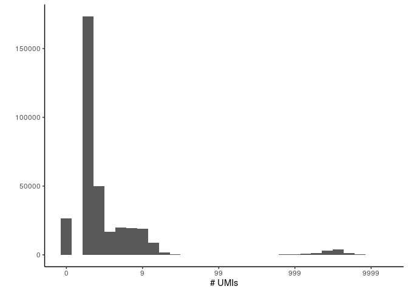
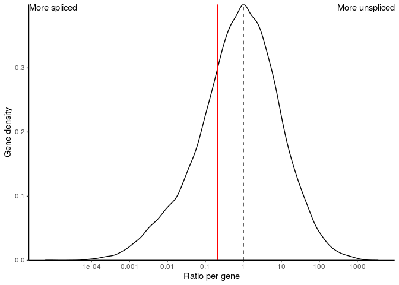
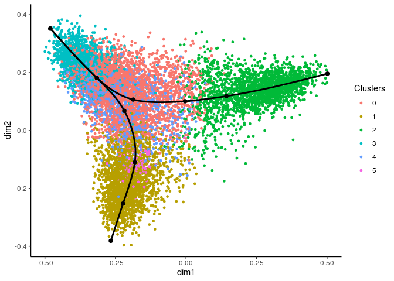
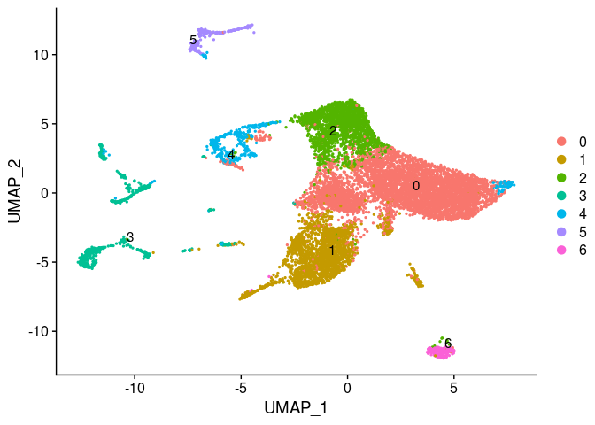

Preprocessing of single-cell RNA-sea and RNA velocity data
================

``` r
library(tidyverse)
library(Seurat)

library(BUSpaRse)
library(SeuratWrappers)
library(DropletUtils)
```

We get two matrices here, for both spliced and unspliced counts. Note
that these are (luckily) loaded in as sparse
matrices.

``` r
sample_folder <- function(x) {paste0("data/adipose_differentiation-merick/SRR8906269/", x)}
velocity_output <- read_velocity_output(
  spliced_dir = sample_folder("introns"),
  spliced_name = "s",
  unspliced_dir = sample_folder("cdna"),
  unspliced_name = "u"
)
spliced <- velocity_output$spliced
unspliced <- velocity_output$unspliced
```

``` r
dim(spliced)
```

    ## [1]  55487 347797

``` r
dim(unspliced)
```

    ## [1]  55487 182687

The spliced matrix contains a lot more cells than the unspliced matrix.
A first indication that we have much more spliced UMIs than unspliced
ones.

# Filtering empty droplets

The kallisto/BUStools pipeline does not do any filtering on the features
or cells (except for zero counts), so it makes sense that most droplets
contain only a very tiny number of UMIs.

``` r
qplot(Matrix::colSums(spliced) + 1) +
  scale_x_log10("# UMIs", labels = function(x) as.integer(x) - 1) +
  theme_classic()
```

    ## `stat_bin()` using `bins = 30`. Pick better value with `binwidth`.

<!-- -->

We will filter these empty droplets here by finding the inflection point
within the total UMI count distribution.

``` r
bc_rank_spliced <- DropletUtils::barcodeRanks(spliced)
bc_rank_unspliced <- DropletUtils::barcodeRanks(unspliced)
```

This function gives us the total UMI counts at which the curves makes an
inflection or
knee

``` r
metadata(bc_rank_spliced)$inflection
```

    ## [1] 259

``` r
metadata(bc_rank_spliced)$knee
```

    ## [1] 2737

``` r
tibble(rank = bc_rank_spliced$rank, total = bc_rank_spliced$total, matrix = "spliced") %>%
  bind_rows(tibble(rank = bc_rank_unspliced$rank, total = bc_rank_unspliced$total, matrix = "unspliced")) %>%
  distinct() %>%
  ggplot(aes(total, rank, color = matrix)) +
  geom_line() +
  scale_color_manual(values = c(spliced = "#0074D9", unspliced = "#FF4136")) +
  geom_vline(xintercept = metadata(bc_rank_spliced)$inflection, color = "#FF4136", linetype = 3) +
  geom_vline(xintercept = metadata(bc_rank_unspliced)$inflection, color = "#0074D9", linetype = 3) +
  scale_x_log10() +
  scale_y_log10() +
  labs(y = "Rank", x = "Total UMI counts") +
  theme_classic()
```

    ## Warning: Transformation introduced infinite values in continuous x-axis

<!-- -->

(Note that this rank vs total count plot is transposed compared to the
plot shown typically shown by e.g. CellRanger)

In this sample, it is clear that a sizeable group of cells has large
spliced UMI counts (1000 - 10000). Note that although the total UMI
counts are different between spliced and unspliced counts, the y
location of the inflection point does not change that much. Moreover,
about same empty droplets are retained in both
analyses:

``` r
bcs_filtered_spliced <- colnames(spliced)[colSums(spliced) > metadata(bc_rank_spliced)$inflection]
bcs_filtered_unspliced <- colnames(unspliced)[colSums(unspliced) > metadata(bc_rank_spliced)$inflection]

length(intersect(bcs_filtered_unspliced, bcs_filtered_spliced)) / length(union(bcs_filtered_unspliced, bcs_filtered_spliced))
```

    ## [1] 0.9696196

We’ll filter using the spliced inflection point

``` r
spliced_filtered <- spliced[, bcs_filtered_spliced]
unspliced_filtered <- unspliced[, bcs_filtered_spliced]

features_filtered <- rownames(spliced_filtered)[Matrix::rowSums(spliced_filtered) > 0]

spliced_filtered <- spliced_filtered[features_filtered,]
unspliced_filtered <- unspliced_filtered[features_filtered,]
```

``` r
dim(spliced_filtered)
```

    ## [1] 23102 11732

# RNA velocity QC

We’ll have a quick look at some statistics about the spliced vs
unspliced reads in the sample, to confirm whether the separate
quantification was
succesful.

## Proportion of unspliced reads

``` r
overall_ratio <- sum(unspliced_filtered@x) / (sum(unspliced_filtered@x) + sum(spliced_filtered@x))
overall_ratio
```

    ## [1] 0.209414

The proportion of unspliced reads is typically around 20%, irregardless
of the technology. This was already described in (Manno et al. 2018).
Although slight deviations between 10% and 50% are possible (especially
outside of mammals), extreme values might indicate that something went
wrong in the detection of unspliced reads.

## Gene-wise proportion

``` r
calculate_ratio <- function(x, y) {
  ratios <- x / y
  ratios[x == 0] <- 0
  ratios[y == 0] <- Inf
  ratios[x == 0 & y == 0] <- NA
  ratios
}
ratios <- calculate_ratio(Matrix::rowSums(unspliced_filtered), Matrix::rowSums(spliced_filtered))
ratios <- tibble(ratio = ratios, gene = rownames(unspliced_filtered))
```

``` r
ratios %>% 
  filter(is.finite(ratio) & ratio > 0) %>% 
  ggplot(aes(x = ratio)) +
    geom_density() +
    scale_x_log10("Ratio per gene", breaks = c(1e-4, 1e-3, 1e-2, 1e-1, 1, 1e1, 1e2, 1e3), labels = identity) +
    geom_vline(xintercept = 1, linetype = "dashed") +
    geom_vline(xintercept = overall_ratio, color = "red") +
    theme_classic() +
    scale_y_continuous("Gene density", expand = c(0, 0)) +
    annotate(geom = "text", label = "More unspliced", y = Inf, x = Inf, hjust = 1, vjust = 1) +
    annotate(geom = "text", label = "More spliced", y = Inf, x = 0, hjust = 0, vjust = 1)
```

    ## Warning: Transformation introduced infinite values in continuous x-axis

<!-- -->

The proportions spliced vs unspliced can be very variable between genes.
This makes sense, given the (probable) variability of splicing
efficiency and the presence and size of introns. Some of this
variability might also be caused by incorrect annotations.

``` r
ratios %>% 
  mutate(ratio = ifelse(ratio > 0 & ratio < Inf, 1, ratio)) %>% 
  pull(ratio) %>% 
  table(useNA = "ifany")
```

    ## .
    ##     0     1 
    ##  5883 17219

0 = no unspliced  
1 = both spliced and unspliced  
Inf = no spliced  
NA = no spliced or unspliced

Ideally, a majority of genes should have both spliced and unspliced
UMIs. Of course, a sizeable set of genes do not have any unspliced
UMIs.

## Cell-wise proportion

``` r
common_cells <- intersect(colnames(unspliced_filtered), colnames(spliced_filtered))
ratios <- calculate_ratio(Matrix::colSums(unspliced_filtered[, common_cells]), Matrix::colSums(spliced_filtered[, common_cells]))
ratios <- tibble(ratio = ratios, cell = common_cells)
```

``` r
ratios %>% 
  filter(is.finite(ratio) & ratio > 0) %>% 
  ggplot(aes(x = ratio)) +
    geom_density() +
    scale_x_log10("Ratio per cell", breaks = c(1e-4, 1e-3, 1e-2, 1e-1, 1, 1e1, 1e2, 1e3), labels = identity) +
    geom_vline(xintercept = 1, linetype = "dashed") +
    geom_vline(xintercept = overall_ratio, color = "red") +
    theme_classic() +
    scale_y_continuous("Cell density", expand = c(0, 0)) +
    annotate(geom = "text", label = "More unspliced", y = Inf, x = Inf, hjust = 1, vjust = 1) +
    annotate(geom = "text", label = "More spliced", y = Inf, x = 0, hjust = 0, vjust = 1)
```

    ## Warning: Transformation introduced infinite values in continuous x-axis

<!-- -->

The proportions spliced vs unspliced per cell is typically more centered
around the “average” proportion. If you see some weird distributions
here, this might indicate that the filtering of cells was not stringent
enough, or that there are batch effects.

``` r
ratios %>% 
  mutate(ratio = ifelse(ratio > 0 & ratio < Inf, 1, ratio)) %>% 
  pull(ratio) %>% 
  table(useNA = "ifany")
```

    ## .
    ##     1 
    ## 11732

0 = no unspliced  
1 = both spliced and unspliced  
Inf = no spliced  
NA = no spliced or unspliced

Ideally, most of the cells should have both spliced and unspliced UMIs.

## Normalization

Let’s do a basic log2 and size factors normalization. SCTransform
(Hafemeister and Satija 2019) can also be used
here.

``` r
seu <- CreateSeuratObject(spliced_filtered, assay = "spliced", min.cells = 3, min.features = 200) %>%
  NormalizeData() %>%
  FindVariableFeatures() %>% 
  ScaleData()
```

    ## Centering and scaling data matrix

``` r
seu[["unspliced"]] <- CreateAssayObject(unspliced_filtered[rownames(seu@assays$spliced@counts), colnames(seu@assays$spliced@counts)]) %>%
  NormalizeData()
```

We only run ScaleData here on the spliced counts, as this is required to
run PCA.

Let’s do some basic clustering and dimensionality reduction.

``` r
DefaultAssay(seu) <- "spliced"
seu <- RunPCA(seu, verbose = FALSE, npcs = 70)
```

``` r
set.seed(1)

seu <- FindNeighbors(seu, verbose = FALSE) %>% 
  FindClusters(resolution = 0.1, verbose = FALSE)
```

``` r
DimPlot(seu, reduction = "pca",pt.size = 0.5, label = TRUE, repel = TRUE)
```

    ## Warning: Using `as.character()` on a quosure is deprecated as of rlang 0.3.0.
    ## Please use `as_label()` or `as_name()` instead.
    ## This warning is displayed once per session.

<!-- -->

``` r
set.seed(1)

seu <- RunUMAP(seu, dims = 1:50, umap.method = "uwot")
```

    ## Warning: The default method for RunUMAP has changed from calling Python UMAP via reticulate to the R-native UWOT using the cosine metric
    ## To use Python UMAP via reticulate, set umap.method to 'umap-learn' and metric to 'correlation'
    ## This message will be shown once per session

    ## 16:46:15 UMAP embedding parameters a = 0.9922 b = 1.112

    ## 16:46:15 Read 11704 rows and found 50 numeric columns

    ## 16:46:15 Using Annoy for neighbor search, n_neighbors = 30

    ## 16:46:15 Building Annoy index with metric = cosine, n_trees = 50

    ## 0%   10   20   30   40   50   60   70   80   90   100%

    ## [----|----|----|----|----|----|----|----|----|----|

    ## **************************************************|
    ## 16:46:18 Writing NN index file to temp file /tmp/RtmprmEQhI/file3c9718e8f78b
    ## 16:46:18 Searching Annoy index using 1 thread, search_k = 3000
    ## 16:46:22 Annoy recall = 100%
    ## 16:46:23 Commencing smooth kNN distance calibration using 1 thread
    ## 16:46:24 Initializing from normalized Laplacian + noise
    ## 16:46:25 Commencing optimization for 200 epochs, with 510802 positive edges
    ## 16:46:38 Optimization finished

``` r
DimPlot(seu, reduction = "umap",pt.size = 0.5, label = TRUE, repel = TRUE)
```

<!-- -->

Do you see the trajectory appearing? Most TI methods assume that only
one trajectory is present in the dataset, with all cells being connected
to this trajectory. We therefore filter those cells out, although you
may want to try a different method, such as PAGA, if you don’t want to
bias the analysis.

``` r
cells_trajectory <- seu@meta.data %>%
  mutate(cell_id = Cells(seu)) %>%
  filter(seurat_clusters %in% c(0, 1, 2)) %>%
  pull(cell_id)

seu_trajectory <- seu[, cells_trajectory]
```

We’ll have a look at RNA velocity and trajectories in the next
notebooks.

``` r
write_rds(seu_trajectory, "data/adipose_differentiation-merick/seu_trajectory.rds")
```

## References

<div id="refs" class="references">

<div id="ref-hafemeisterNormalizationVarianceStabilization2019">

Hafemeister, Christoph, and Rahul Satija. 2019. “Normalization and
Variance Stabilization of Single-Cell RNA-Seq Data Using Regularized
Negative Binomial Regression.” *bioRxiv*, March, 576827.
<https://doi.org/10.1101/576827>.

</div>

<div id="ref-mannoRNAVelocitySingle2018">

Manno, Gioele La, Ruslan Soldatov, Amit Zeisel, Emelie Braun, Hannah
Hochgerner, Viktor Petukhov, Katja Lidschreiber, et al. 2018. “RNA
Velocity of Single Cells.” *Nature* 560 (7719): 494–98.
<https://doi.org/10.1038/s41586-018-0414-6>.

</div>

</div>
