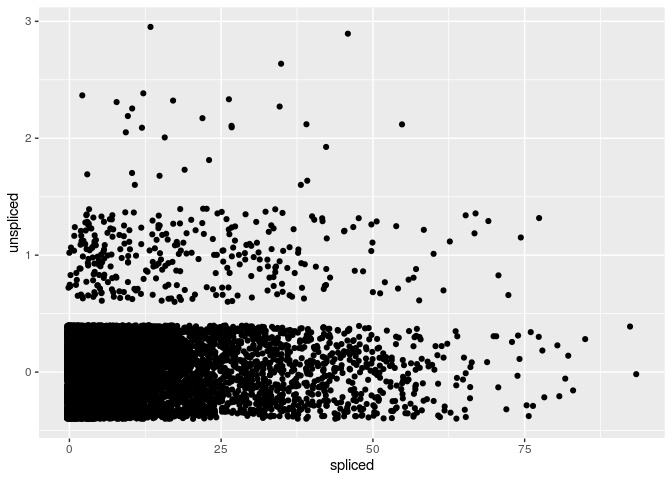
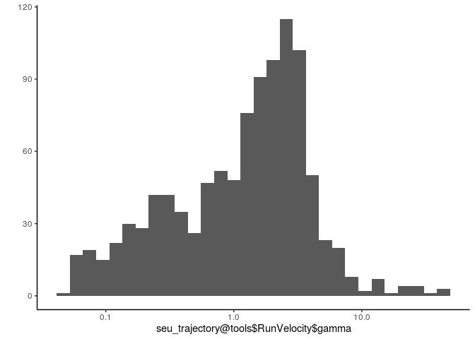
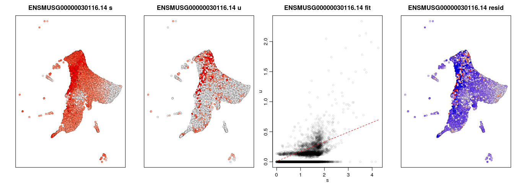
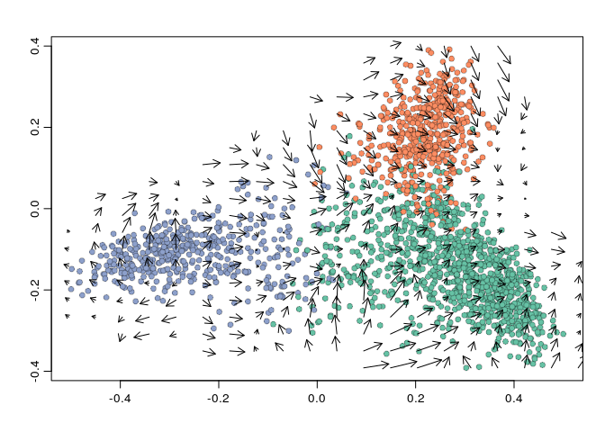
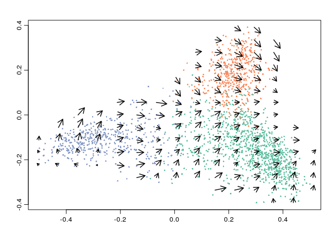
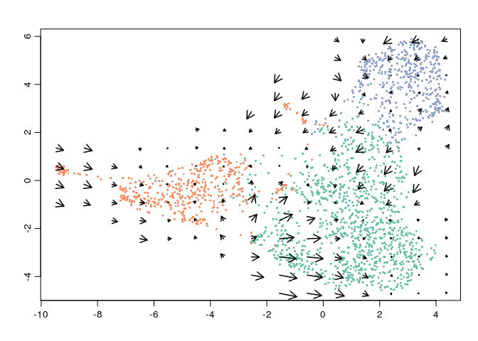

Inferring a trajectory with slingshot
================

``` r
library(tidyverse)
library(velocyto.R)
library(Seurat)
library(SeuratWrappers)
```

``` r
seu_trajectory <- read_rds("data/adipose_differentiation-merick/seu_trajectory.rds")
feature_info <- read_tsv("data/adipose_differentiation-merick/feature_info.tsv")
```

    ## Parsed with column specification:
    ## cols(
    ##   feature_id = col_character(),
    ##   symbol = col_character()
    ## )

``` r
feature_mapper <- function(x) {feature_info %>% dplyr::slice(base::match(symbol, x)) %>% dplyr::pull(feature_id)}
```

## Estimating the future state of a cell

Our dataset contains two assays: the number of spliced and unspliced
reads.

``` r
seu_trajectory@assays$spliced
```

    ## Assay data with 19032 features for 9907 cells
    ## Top 10 variable features:
    ##  ENSMUSG00000027559.5, ENSMUSG00000056569.10, ENSMUSG00000035783.9,
    ## ENSMUSG00000041607.17, ENSMUSG00000022037.15,
    ## ENSMUSG00000029675.12, ENSMUSG00000062515.3, ENSMUSG00000022878.5,
    ## ENSMUSG00000018217.12, ENSMUSG00000041378.2

``` r
seu_trajectory@assays$unspliced
```

    ## Assay data with 19032 features for 9907 cells
    ## First 10 features:
    ##  ENSMUSG00000000001.4, ENSMUSG00000020875.9, ENSMUSG00000000028.15,
    ## ENSMUSG00000048583.16, ENSMUSG00000000049.11,
    ## ENSMUSG00000000078.7, ENSMUSG00000000085.16, ENSMUSG00000000088.7,
    ## ENSMUSG00000061689.15, ENSMUSG00000000093.6

Let’s get a feeling of how this data actually looks like. Let’s take the
gene that was most associated with pseudotime according to tradeSeq.

``` r
tibble(
  spliced = seu_trajectory@assays$spliced@counts["ENSMUSG00000030116.14", ],
  unspliced = seu_trajectory@assays$unspliced@counts["ENSMUSG00000030116.14", ]
) %>% 
  ggplot(aes(spliced, unspliced)) +
    geom_jitter()
```

<!-- -->

From this, we want to predict a future state of the cell.

A naive approach would be to use the `unspliced` matrix as a prediction
of what the `spliced` matrix will look like in the future. However, such
an approach would make some big assumptions, such as identical splicing
rates and degradation rates for each gene, which are easily violated
(Manno et al. 2018).

Instead, we need to have an idea on the balance between the generation
of new spliced mRNA (i.e. splicing rates) and removal of spliced mRNA
(i.e. degradation rates). We don’t need to know the exact speed of
either of these processes, but rather the ratio between the two. If we
would know this, we would be able to use the current amount of unspliced
mRNA and see how much is generated *in relationship* to the degradation
of old spliced mRNA. We can only do this for a short time interval where
we can assume that the unspliced mRNA is in a steady state, and does not
change too much based on gene regulation (or post-transcriptional
regulation).

How can we estimate the ratio of splicing vs degradation, i.e. γ? We
might assume that if the number of mRNAs is very high or very low, it
has reached a steady state. In this steady state, the ratio between
splicing and degradation is simply equal to the ratio between unspliced
and spliced mRNAs. This way of estimating the γ is implemented in the
velocyto.R package. Note however that this makes many assumptions, which
could be easily violated in real settings:

  - It assumes that there is one common γ for each gene. Although some
    data suggests this might be ok for most cell types (Manno et al.
    2018), some more in depth study across cell types might be necessary
    to really prove this assumption.
  - It assumes that the gene reaches a steady state at the lowest and
    highest expression levels within the dataset.

As this is still a topic of active research, some alternative models are
also being proposed, e.g. the ones created in the python scvelo package
(<https://scvelo.readthedocs.io/about.html>). These do not make less
assumptions, but at the cost of being more computationally intensive.
Some benchmarking will undoubtedly be necessary to assess whether these
alternatives do generate more accurate models.

Another important point to consider is that the observed counts of both
unspliced and spliced reads are very noisy. Estimating the future state
of a cell based on these values would therefore amplify this noise even
further, leading to highly variable and inaccurate estimations. One way
to mitigate this is by pooling the unspliced and spliced counts from
similar cells (similarly to imputation methods) through a kNN. Keep in
mind that this introduces yet another bias into the analysis, and that
subtle differences of just a couple of cells are possibly “smoothed out”
by this kNN.

The estimation of labmda and projection to a future state are both
implemented in the `velocyto.R::gene.relative.velocity.estimates()`
function. The SeuratWrappers package provides a helpful wrapper for this
to run this within
Seurat:

``` r
seu_trajectory <- RunVelocity(seu_trajectory, spliced.average = 0.2, unspliced.average = 0.05)
```

    ## Filtering genes in the spliced matrix

    ## Filtering genes in the unspliced matrix

    ## Calculating embedding distance matrix

Because of the computational complexity of estimating the lambda, we add
some extra filtering on the spliced and unspliced counts. I know, this
introduces yet another bias, so feel free to loosen this filtering if
you have the patience.

We now have extra information in the `seu_trajectory@tools$RunVelocity`.
Among which are the projected (future) state of the cell (this is stored
as a non-sparse matrix, another reason why some prior filtering is
important):

``` r
seu_trajectory@tools$RunVelocity$projected[1:10, 1:10]
```

    ## 10 x 10 Matrix of class "dgeMatrix"
    ##                       AAACCTGAGAACTGTA AAACCTGAGCGATATA AAACCTGAGGCTCAGA
    ## ENSMUSG00000000001.4         0.1568749        0.0000000        1.7689540
    ## ENSMUSG00000000078.7         2.0832062        1.1993771        2.3274916
    ## ENSMUSG00000000127.15        0.0000000        0.0000000        0.0000000
    ## ENSMUSG00000000184.12        1.1926126        1.7094597        1.9737503
    ## ENSMUSG00000000326.13        1.9523991        1.0877286        0.0000000
    ## ENSMUSG00000020676.2         0.1326149        1.0961372        0.2620822
    ## ENSMUSG00000000392.17        1.5999379        0.0000000        0.0000000
    ## ENSMUSG00000000420.15        0.0000000        0.0000000        0.0000000
    ## ENSMUSG00000000440.12        0.8587818        0.0000000        0.0000000
    ## ENSMUSG00000028494.12        0.1826555        0.8253277        0.0000000
    ##                       AAACCTGAGTGGTAGC AAACCTGCACCTATCC AAACCTGCACGCATCG
    ## ENSMUSG00000000001.4         0.0000000        0.0000000        0.0000000
    ## ENSMUSG00000000078.7         3.0871677        2.4644496        2.4989791
    ## ENSMUSG00000000127.15        0.0000000        0.0000000        0.1912351
    ## ENSMUSG00000000184.12        0.0000000        0.6961385        0.0000000
    ## ENSMUSG00000000326.13        0.1635452        0.0000000        0.0000000
    ## ENSMUSG00000020676.2         1.8346496        1.4830335        2.8113450
    ## ENSMUSG00000000392.17        0.2952473        0.0000000        0.0000000
    ## ENSMUSG00000000420.15        1.8501481        0.0000000        0.0000000
    ## ENSMUSG00000000440.12        0.0000000        1.4205304        0.0000000
    ## ENSMUSG00000028494.12        0.0000000        0.0000000        0.0000000
    ##                       AAACCTGCATGTTGAC AAACCTGGTAAGGGAA AAACCTGGTCAAAGCG
    ## ENSMUSG00000000001.4          0.000000        0.0000000        0.0000000
    ## ENSMUSG00000000078.7          0.000000        1.8203815        1.8523620
    ## ENSMUSG00000000127.15         0.000000        0.0000000        0.0000000
    ## ENSMUSG00000000184.12         1.375927        0.1983737        1.9966445
    ## ENSMUSG00000000326.13         0.000000        0.0000000        0.6861063
    ## ENSMUSG00000020676.2          3.371028        1.2583564        1.0664344
    ## ENSMUSG00000000392.17         1.215607        1.9048323        1.2910061
    ## ENSMUSG00000000420.15         1.925279        0.1117591        0.9666061
    ## ENSMUSG00000000440.12         1.138872        0.0000000        1.1334433
    ## ENSMUSG00000028494.12         1.810813        1.2915418        1.3371846
    ##                       AAACCTGGTCCGAATT
    ## ENSMUSG00000000001.4          0.000000
    ## ENSMUSG00000000078.7          2.572604
    ## ENSMUSG00000000127.15         0.000000
    ## ENSMUSG00000000184.12         0.000000
    ## ENSMUSG00000000326.13         1.342274
    ## ENSMUSG00000020676.2          0.000000
    ## ENSMUSG00000000392.17         0.000000
    ## ENSMUSG00000000420.15         0.000000
    ## ENSMUSG00000000440.12         0.000000
    ## ENSMUSG00000028494.12         0.000000

The predicted gamma values for each
    gene

``` r
head(seu_trajectory@tools$RunVelocity$gamma)
```

    ##  ENSMUSG00000000001.4  ENSMUSG00000000078.7 ENSMUSG00000000127.15 
    ##            1.63643096            0.08601202            4.10679019 
    ## ENSMUSG00000000184.12 ENSMUSG00000000326.13  ENSMUSG00000020676.2 
    ##            0.13993568            0.67257176            0.05601417

``` r
qplot(seu_trajectory@tools$RunVelocity$gamma) + scale_x_log10() + theme_classic()
```

    ## `stat_bin()` using `bins = 30`. Pick better value with `binwidth`.

<!-- -->

And the kNN if you would want to use it for some other
    purpose:

``` r
seu_trajectory@tools$RunVelocity$cellKNN[1:10, 1:10]
```

    ## 10 x 10 sparse Matrix of class "dgCMatrix"

    ##    [[ suppressing 10 column names 'AAACCTGAGAACTGTA', 'AAACCTGAGCGATATA', 'AAACCTGAGGCTCAGA' ... ]]

    ##                                     
    ## AAACCTGAGAACTGTA 1 . . . . . . . . .
    ## AAACCTGAGCGATATA . 1 . . . . . . . .
    ## AAACCTGAGGCTCAGA . . 1 . . . . . . .
    ## AAACCTGAGTGGTAGC . . . 1 . . . . . .
    ## AAACCTGCACCTATCC . . . . 1 . . . . .
    ## AAACCTGCACGCATCG . . . . . 1 . . . .
    ## AAACCTGCATGTTGAC . . . . . . 1 . . .
    ## AAACCTGGTAAGGGAA . . . . . . . 1 . .
    ## AAACCTGGTCAAAGCG . . . . . . . . 1 .
    ## AAACCTGGTCCGAATT . . . . . . . . . 1

To understand this better, let’s plot these values for the Dpp4 gene
(the `show.gene` argument here will estimate the γ for this gene only
instead of all):

``` r
gene.relative.velocity.estimates(
  GetAssayData(seu_trajectory, slot = "data", assay = "spliced"),
  GetAssayData(seu_trajectory, slot = "data", assay = "unspliced"),
  cell.emb = Embeddings(seu_trajectory, "umap"),
  show.gene = "ENSMUSG00000030116.14",
  old.fit = Tool(seu_trajectory, slot = "RunVelocity")
)
```

    ## calculating convolved matrices ... done

<!-- -->

    ## [1] 1

These plots show the sliced counts, unspliced counts, the relationship
between the two and an estimate of whether the gene’s expression is
decreasing (blue) or increasing (red). The estimate for lamba is shown
in the third plot as a red dashed line. As you can see, most cells are
under this line, meaning that their expression is decreasing. Also note
the red dots to the right: although this suggests that some cells have a
high upregulation of this gene, a more plausible explanation would be
that these cells had relatively high unspliced reads just by chance.
What we’re probably seeing is something akin to ‘overinflation of
fold-changes’ just like in bulk data.

Investigating the velocity of one feature can be misleading, because
wrong annotations, problems with the estimation of γ and low counts.
More useful (or in the very least robust) is therefore to pool the
information across the genes, and see the direction into which the cells
are moving.

To do this, we have two options: (1) we can use an existing
dimensionality reduction and map the projected cells onto it, or (2) we
can either plot both the cells and their projected counterparts on a new
dimesionality reduction.

The first option is the one that you’re most probably want to use, given
that you often already have a good dimensionality reduction that you use
across the project. But at the same time, it is the most difficult one:

  - If the dimensionality reduction allows you to map new data, this is
    pretty straightforward. We can just map the projected state of the
    cell in the embedding. PCA is the best known example of such a
    method.

  - If the dimensionality reduction does not have a mapping function, we
    have to use the existing points in the embedding to estimate where
    the projected cells will lie. This includes most dimensionality
    reduction methods, such as MDS, t-SNE and UMAP.

Let’s try out the second approach, with the following dimensionality
reductions:

``` r
# for demonstration we use a subsampled seurat object here because the following steps are very time consuming
set.seed(1)
seu_velocity <- seu_trajectory[, sample(colnames(seu_trajectory), 2000)]


# MDS, we use the landmark mds because it is much faster and memory efficient
set.seed(1)
lmds <- dyndimred::dimred_landmark_mds(Matrix::t(seu_velocity@assays$spliced@scale.data))
colnames(lmds) <- paste0("lmds_", seq_len(ncol(lmds)))
lmds_object <- CreateDimReducObject(lmds, key = "lmds_", assay = "spliced")
seu_velocity@reductions$lmds <- lmds_object

# UMAP, based on the R uwot implementation
set.seed(1)
seu_velocity <- RunUMAP(seu_velocity, dims = 1:50, umap.method = "uwot")
```

``` r
cell_pal <- function(cell_cats, pal_fun) {
  categories <- sort(unique(cell_cats))
  pal <- setNames(pal_fun(length(categories)), categories)
  pal[cell_cats]
}
cell_colors <- cell_pal(seu_velocity$seurat_clusters, scales::brewer_pal("qual", "Set2"))
cell_colors_clust <- cell_pal(seu_velocity$seurat_clusters, scales::hue_pal())
names(cell_colors) <- names(cell_colors_clust) <- colnames(seu_velocity)

cc_mds <- velocyto.R::show.velocity.on.embedding.cor(
  emb = Embeddings(seu_velocity, "lmds"),
  vel = Tool(seu_velocity, slot = "RunVelocity"),
  show.grid.flow = TRUE,
  cell.colors = cell_colors
)
```

<!-- -->

    ## delta projections ... log knn ... transition probs ... done
    ## calculating arrows ... done
    ## grid estimates ... grid.sd= 0.03428785  min.arrow.size= 0.000685757  max.grid.arrow.length= 0.09156871  done

We have to tune some parameters here to make this chaotic plot more
interpretable

``` r
cc_mds <- velocyto.R::show.velocity.on.embedding.cor(
  emb = Embeddings(seu_velocity, "lmds"),
  vel = Tool(seu_velocity, slot = "RunVelocity"),
  show.grid.flow = TRUE,
  cell.colors = cell_colors,
  
  # algorithm parameters
  grid.n = 15, # number of points to plot for the grid
  n = 200, # smooth more over nearby cells
  min.grid.cell.mass = 50, # higher values will mean only arrows in highly dense regions
  
  # aesthetic paramters
  cex = 0.5,
  cell.border.alpha = 0,
  arrow.scale = 1,
  arrow.lwd = 1.5,
)
```

<!-- -->

    ## delta projections ... log knn ... transition probs ... done
    ## calculating arrows ... done
    ## grid estimates ... grid.sd= 0.04568326  min.arrow.size= 0.0009136652  max.grid.arrow.length= 0.1220916  done

And on UMAP

``` r
cc_mds <- velocyto.R::show.velocity.on.embedding.cor(
  emb = Embeddings(seu_velocity, "umap"),
  vel = Tool(seu_velocity, slot = "RunVelocity"),
  show.grid.flow = TRUE,
  cell.colors = cell_colors,
  
  # algorithm parameters
  grid.n = 15,
  n = 200,
  min.grid.cell.mass = 1,
  
  # aesthetic paramters
  cex = 0.5,
  cell.border.alpha = 0,
  arrow.scale = 6,
  arrow.lwd = 1.5,
)
```

<!-- -->

    ## delta projections ... log knn ... transition probs ... done
    ## calculating arrows ... done
    ## grid estimates ... grid.sd= 0.6224985  min.arrow.size= 0.01244997  max.grid.arrow.length= 0.1220916  done

Plotting RNA velocity vectors is still a bit of a tricky business,
because there are many factors to consider: - The vectors are inherintly
very noisy, so you need to average over many cells - You can’t average
too much, otherwise you could miss subtle local effects - High density
regions highly influence the vectors of nearby low density regions (a
similar problem exists with imputation methods)

Observe how even a small change in parameters (mds vs umap) impacts the
velocity vectors. Although the main message remains the same This result
will likely become more robust if we include more cells, instead of the
subsample of cells that was used here.

Plotting RNA velocity on an existing dimensionality reduction may
introduce some artifacts, particularly for cells at the “border”. What
if their future cell state is not contained in any of the other cells in
the dataset? Observe how the arrows at the end of the two terminal
populations often point inwards. This makes sense, given that the

Alternatively, we can also create an embedding in wich both the cells
and their projected state are embedded at the same time. velocyto.R only
provides functions to do this for PCA and UMAP, e.g.:

``` r
cc_mds <- velocyto.R::tSNE.velocity.plot(
  vel = Tool(seu_velocity, slot = "RunVelocity"),
  show.grid.flow = TRUE,
  cell.colors = cell_colors,
  
  # algorithm parameters
  grid.n = 15,
  min.grid.cell.mass = 1,
  
  # aesthetic paramters
  cex = 0.5,
  cell.border.alpha = 0,
  # arrow.scale = 6,
  arrow.lwd = 1.5,
)
```

This may take quite a while to run, given that the t-SNE has to be
computed on double the number of cells.

<div id="refs" class="references">

<div id="ref-mannoRNAVelocitySingle2018">

Manno, Gioele La, Ruslan Soldatov, Amit Zeisel, Emelie Braun, Hannah
Hochgerner, Viktor Petukhov, Katja Lidschreiber, et al. 2018. “RNA
Velocity of Single Cells.” *Nature* 560 (7719): 494–98.
<https://doi.org/10.1038/s41586-018-0414-6>.

</div>

</div>
